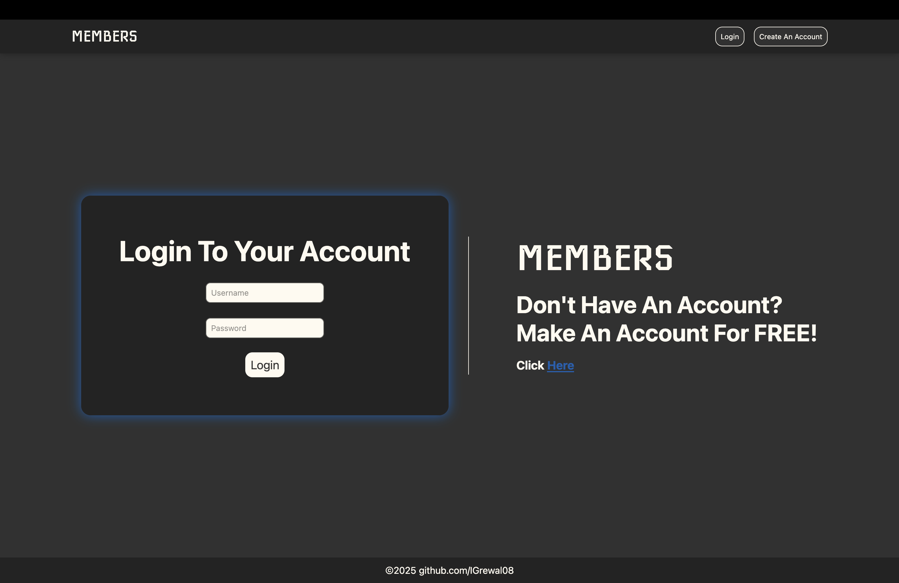
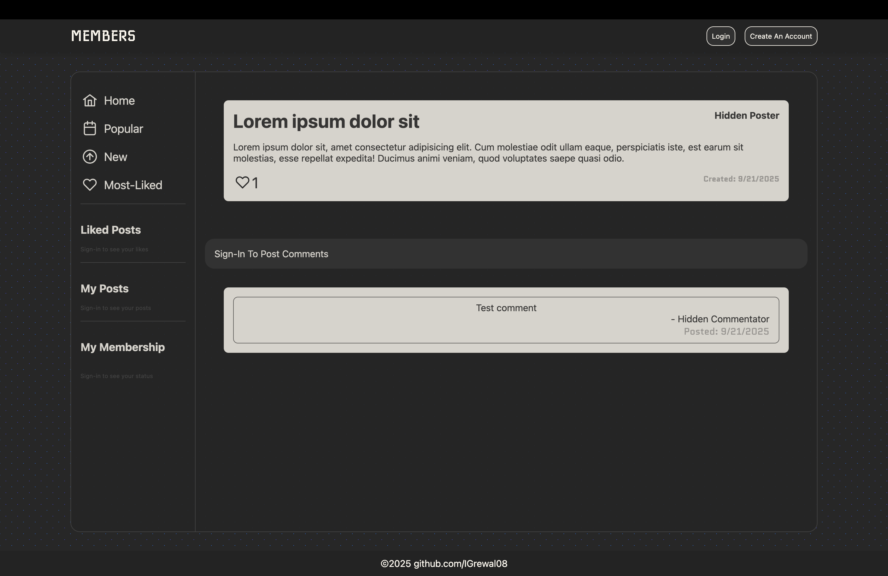

# Member Boards
This is a private, anonymous community message board application. Users can sign up, log in, and create posts with password hashing. A core feature is the implementation of user roles and membership levels which dictate access to certain data and moderation abilities. Posts are anonymous to general members, revealing the poster's identity only to users with the 'Membership' status or higher.




## Technologies
* Node.js v22.14
* PostgreSql v17.6
* pg 8.16
* Express.js 5.1
* ejs 3.1
* Passport.js v0.7
* bcrypt.js v3.0
* Docker
* nginx

## Installation and Setup
### Environment Setup
Create a .env file in the root directory and add the following
```
# Database Credentials (Docker will use these to set up the DB)
DATABASE_USER=admin
DATABASE_NAME='members'
DATABASE_PASSWORD=password123

# Connection Details (Host must be 'db' for Docker networking)
DATABASE_URL='postgresql://admin:password123@db:5432/members'
DATABASE_HOST=db
DATABASE_PORT=5432

# App Settings
PORT=3000
SESSION_NAME=sessions
UPGRADE_CODE=77
```

### Launch
Run the following command in your terminal, once running the application is available at: http://localhost
```
docker-compose up --build
```
